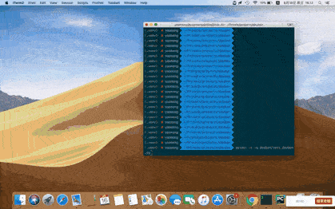

# pytest-pyppeteer
Test with [pyppeteer](https://github.com/pyppeteer/pyppeteer) in pytest.


[](https://github.com/luizyao/pytest-pyppeteer/issues)
[](https://pypi.org/project/pytest-pyppeteer/)
[](https://pypi.org/project/pytest-pyppeteer/)
[](https://github.com/psf/black)
[](https://github.com/frinyvonnick/gitmoji-changelog)
[](LICENSE)

# Installation

## Requirements
pytest-pyppeteer work with Python >=3.6.

## Install pytest-pyppeteer

```bash
pip install pytest-pyppeteer
```

or install latest one:

```bash
pip install git+https://github.com/luizyao/pytest-pyppeteer.git
```

# Quickstart
For example, compare the scores of a book and its movie on [Douban](https://www.douban.com).

## `--nptp, --new-pyppeteer-test-project`
Create a new pyppeteer test project in the specified path.

```bash
pytest --nptp=douban
```

The directory structure:

```bash
├── desc
├── pyproject.toml
└── test_douban.py

1 directory, 2 files
```

## Configuration

### `desc`
Create two files `douban_movie.desc` and `douban_book.desc` in `desc` directory.

> `[HomePage]` is required.

```toml
# douban_movie.desc

[HomePage]
#CSS
search_input = '#inp-query'
search_apply = '.inp-btn > input:nth-child(1)'

[SearchResultsPage]
# {} indicates that this part can be replaced by the custom parameter
# CSS
result = '#root > div > div > div > div > div:nth-child({}) > div.item-root a.cover-link'

[DetailPage]
rating = '#interest_sectl > div.rating_wrap.clearbox > div.rating_self.clearfix > strong'
```

```toml
# douban_book.desc

[HomePage]
#CSS
search_input = '#inp-query'
search_apply = '.inp-btn > input:nth-child(1)'

[SearchResultsPage]
# {} indicates that this part can be replaced by the custom parameter
# Xpath
result = '(//*[@class="item-root"])[{}]/a'

[DetailPage]
rating = '#interest_sectl > div > div.rating_self.clearfix > strong'
```

### `pyproject.toml`
Add `target`:

```toml
[tool.pytest.pyppeteer.targets]
[tool.pytest.pyppeteer.targets.target1]
name = "douban_movie"
base_url = "https://movie.douban.com/"

[tool.pytest.pyppeteer.targets.target2]
name = "douban_book"
base_url = "https://book.douban.com/"
```

Path `executablePath` to a Chromium or Chrome executable.

```toml
[tool.pytest.pyppeteer.options]
executablePath = "/Applications/Chrome.app/Contents/MacOS/Google Chrome"
```

## Write tests
```python
# test_douban.py

import asyncio
from functools import partial

import pytest
from pytest_pyppeteer.models import Pyppeteer


async def query_rating(target: Pyppeteer, movie_or_book_name: str):
    await target.open(goto_base_url=True)
    await target.input("search_input", text=movie_or_book_name)
    await target.click("search_apply")

    # Into search results page
    target.switch_page("SearchResultsPage")
    # Click the first result
    await target.click("result", custom_parameter=(1,))

    # Into detail page
    target.switch_page("DetailPage")
    rating: str = await target.get_value("rating")
    await target.close()
    return rating


@pytest.mark.parametrize("target", [("target1", "target2")], indirect=True)
async def test_shawshank_rating(target):
    target1, target2 = target
    shawshank_rating = partial(
        query_rating, movie_or_book_name="The Shawshank Redemption"
    )

    movie_rating, book_rating = await asyncio.gather(
        shawshank_rating(target1), shawshank_rating(target2)
    )

    assert movie_rating == book_rating
```

## Execute tests screenshot


# Usage

## Locator

### `CSS` selector

```toml
[SearchResultsPage]
# {} indicates that this part can be replaced by the custom parameter
# CSS
result = '#root > div > div > div > div > div:nth-child({}) > div.item-root a.cover-link'
```

### `XPath`

```toml
[SearchResultsPage]
# {} indicates that this part can be replaced by the custom parameter
# XPath
result = '(//*[@class="item-root"])[{}]/a'
```

Use XPath locate element via element certain content. e.g. `contains(text(), "{}")`:

```toml
details_item = '//*[@class="overview-info"]//div[@class="item-label"][contains(text(), "{}")]/following-sibling::div[@class="item-content"]'
```

> CSS doesn't support content selector, refer to <https://www.w3.org/TR/selectors-3/#content-selectors>

### Replace `{}` with custom parameter:

```python
# Get the first result
await target.click("result", custom_parameter=(1,))
```

If only one custom parameter:

```python
# Get the first result
await target.click("result", custom_parameter=1)
```

## Target

### One target
Direct to use `target` in test script:

```python
@pytest.mark.parametrize("target", ["target1"], indirect=True)
async def test_001(target: Pyppeteer):
    await target.open(goto_base_url=True)
```

### Multiple targets
```python
@pytest.mark.parametrize("target", [("target1", "target2")], indirect=True)
async def test_shawshank_rating(target):
    target1, target2 = target
```

## Clear before input

```python
await target.input("search_input", text="The Shawshank Redemption", clear=True)
```

## Screenshot

```python
await target.screenshot(Path(__file__).parent / "screenshot_binary.png")
```

## Hooks

### `pytest_pyppeteer_targets_setup`
Called to setup target before execute a test item.

e.g. Open browser and goto base url.

```python
async def pytest_pyppeteer_targets_setup(item: Item) -> None:
    targets: Dict[str, Pyppeteer] = item.targets  # type: ignore

    async def setup(target: Pyppeteer):
        await target.open(goto_base_url=True)

    await asyncio.gather(*map(setup, targets.values()))
```

### `pytest_pyppeteer_targets_teardown`
Called to teardown target after execute a test item.

e.g. Take a screenshot for all target used when test failed.

```python
async def pytest_pyppeteer_targets_teardown(item: Item) -> None:
    targets: Dict[str, Pyppeteer] = item.targets  # type: ignore

    async def teardown(name: str, target: Pyppeteer):
        if item.res_call.failed:
            await asyncio.sleep(1)
            screenshot_base64 = await target.screenshot(type_="png", encoding="base64")
            allure.attach(
                base64.b64decode(screenshot_base64),
                name=name,
                attachment_type=allure.attachment_type.PNG,
            )

    await asyncio.gather(*[teardown(name, target) for name, target in targets.items()])
```

### `pytest_pyppeteer_all_targets_teardown`
Called to teardown all targets after execute all test items.

e.g. Make sure to close all targets.

```python
async def pytest_pyppeteer_all_targets_teardown(targets: Pyppeteer) -> None:
    async def teardown(target: Pyppeteer):
        await target.close()

    await asyncio.gather(*map(teardown, targets))
```

# License
[MIT License](LICENSE)

# Changelog

## 0.1.2 (2020-08-26)

### Added

- ✨ support for the same target sharing the same browser instance throughout the test session [[5e51d75](https://github.com/luizyao/pytest-pyppeteer/commit/5e51d757ef6207a901683335d332dcfe5ebb2dc3)]
- ✨ add screenshot function [[310f848](https://github.com/luizyao/pytest-pyppeteer/commit/310f848fa7abc97e90daaded3cb4342f291dcb86)]

### Fixed

- 🐛 fix issue [#6](https://github.com/luizyao/pytest-pyppeteer/issues/6) [[5d1f6af](https://github.com/luizyao/pytest-pyppeteer/commit/5d1f6afe8cebff37e0aec395f3c38539fb24e2eb)]

<a name="0.1.1"></a>

## 0.1.1 (2020-08-22)

### Added

- ✨ add target.hover function [[c0fe87e](https://github.com/luizyao/pytest-pyppeteer/commit/c0fe87ee73d903072cb8d4c79592fdd3633bd3c8)]

### Fixed

- 🐛 fix issue [#4](https://github.com/luizyao/pytest-pyppeteer/issues/4) [[f2af677](https://github.com/luizyao/pytest-pyppeteer/commit/f2af6776ed02f56fb0fed1798d61d0c46a9202e2)]
- 🐛 fix issue [#2](https://github.com/luizyao/pytest-pyppeteer/issues/2) [[4537d16](https://github.com/luizyao/pytest-pyppeteer/commit/4537d16f95c2a5300b5fbbff12fe5eb42a880dab)]

> More details refer to [CHANGELOG](CHANGELOG.md).
